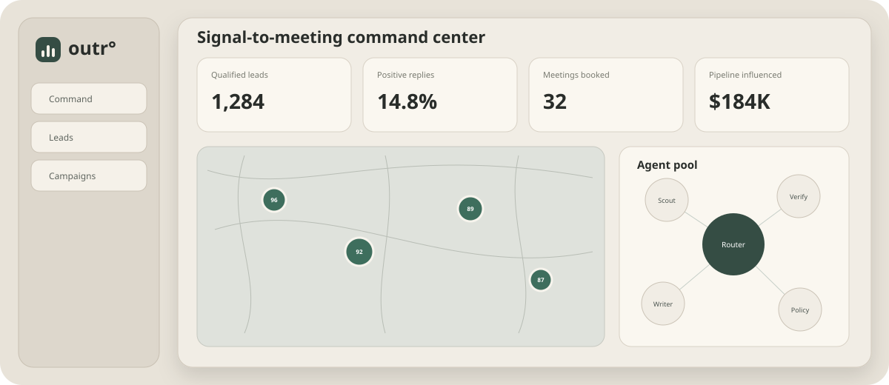

# Outr

Outr is an agency-first **signal-to-meeting operating system**. It combines an evidence-backed prospect ledger, territory map, approval-bound campaigns, suppression and compliance controls, a unified reply inbox, and a typed pool of specialist agents.



## What is implemented

- **Command center** — qualified-lead, reply, meeting and pipeline metrics; activity funnel; agent pulse; sending-health gates.
- **Lead explorer** — synchronized MapLibre map/list, fit and intent filters, account evidence drawer, search, sorting, verification state and suppression action.
- **Campaign studio** — campaign readiness, sequences, explicit approval state, local-time scheduling and stop-on-reply semantics.
- **Agent pool** — eighteen bounded agent definitions, typed jobs, capability allowlists, job results and append-only events.
- Pool-backed specialists execute in the OutreachOS common pool through the `run_agent` bridge: Signal Scout (trigger re-scoring + lead revival), Meeting Booker (slot proposals + OOO requeue), ICP Refiner (outcome→targeting loop), Deliverability Ops (inbox health gates), Client Reporter (retainer-grade weekly reports).
- **Unified inbox** — reply categorization, human review, next-action recommendation and approval before send.
- **Local API** — Fastify + Zod, tenant-scoped resources, atomic JSON persistence, GeoJSON endpoints, campaign approvals, immutable suppression, compliance gates and event ledger.
- **Shared contracts** — lead, campaign, approval, suppression, agent, job, event and compliance schemas.

Deep research basis: `docs/AI_OUTREACH_AGENCY_RESEARCH_2026.md` (competitor matrix: Apollo, Instantly, Smartlead, Lemlist, Clay, Reply, AiSDR, Artisan, 11x, Regie, Common Room; agency model $10–30K/mo).

Real outbound transmission is not part of this local baseline. The API reports `sendingEnabled: false`; activation requires verified provider/sender evidence and an approved deployment adapter.

## Run locally

Requirements: Node.js 22+ and npm 11+.

```bash
npm install

# terminal 1 — API at http://127.0.0.1:8787
npm run dev:api

# terminal 2 — app at http://127.0.0.1:5173
npm run dev:web
```

The web app calls the local API origin at `http://127.0.0.1:8787` by default; set `VITE_API_BASE_URL` for a hosted API. If the API is offline, deterministic UI fixtures keep the product explorable. API data is stored atomically under `apps/api/data/`.

## Verify

```bash
npm run check
curl -s http://127.0.0.1:8787/health
curl -s -H 'x-workspace-id: demo' http://127.0.0.1:8787/v1/summary
```

## Architecture

```text
apps/web  ──typed JSON──> apps/api ──atomic update──> local data store
    │                         │
    └── MapLibre              ├── agent registry / typed jobs
                              ├── approval + compliance gates
packages/contracts <──────────┴── event and suppression ledgers
```

Read [product research](docs/RESEARCH.md), [architecture](docs/ARCHITECTURE.md), [agent system](docs/AGENTS.md), and [deployment stages](docs/DEPLOYMENT.md).

## Product direction

The wedge is not another high-volume sequencer. It is a client-owned agency control room where **geography, evidence, cost, consent/suppression, and human accountability** are first-class data. The recommended commercial path is four Growth clients at roughly $2,500/month to reach $10K MRR, then scale toward $30K with stronger inbox, connector and client-portal operations—not indiscriminate volume.
